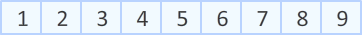
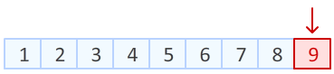
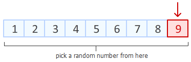
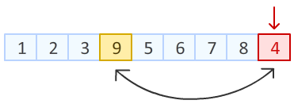
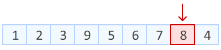
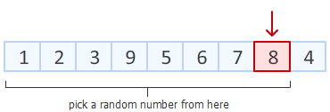
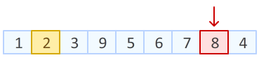
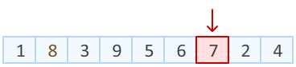

## Fisher–Yates shuffle 洗牌算法

我们简单借助图形来理解（图片来源于网络）

首先我们有一个已经排好序的数组：


**Step1：**
第一步需要做的就是，从数组末尾开始，选取最后一个元素。

在数组一共 9 个位置中，随机产生一个位置（范围在从 0～当前位置），该位置元素与最后一个元素进行交换。



**Step2：**
上一步中，我们已经把数组末尾元素进行随机置换。
接下来，对数组倒数第二个元素动手。在除去已经排好的最后一个元素位置以外的8个位置中，随机产生一个位置，该位置元素与倒数第二个元素进行交换



**Step3：**
接下来就是依次进行，向前移动，随机一个位置，交互位置



## JS实现如下
```
    //洗牌算法
    function shuffle() {
        const arr = [1, 2, 3, 4, 5];
        for (var i = arr.length - 1; i > 0; i--) {
            const random = Math.floor(Math.random() * (i + 1));
            //交换 arr[i] 和 arr[random]

            // const temp = arr[i];
            // arr[i] = arr[random];
            // arr[random] = temp;

            //与上面三行等效
            [arr[i], arr[random]] = [arr[random], arr[i]];
        }
        return arr
    }
    const re = shuffle();
    console.log(re);
```