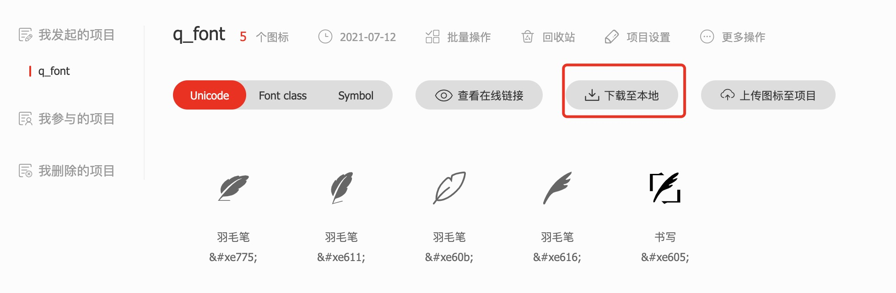

## Iconfont 的使用
首先登录[Iconfont](https://www.iconfont.cn/),通过搜索框搜索自己想要的Icon

找到自己喜欢的Icon，然后加入购物车,可可添加多个

点击购物车按钮,将自己选择的Icon加入项目，如果没有项目就创建一个项目

最后在资源管理-我的项目，开始下载项目

下载完解压项目我们会看到如下文件
```
font_xxxx
---iconfont.woff2
---iconfont.woff
---iconfont.ttf
---iconfont.json
---iconfont.js
---iconfont.css
---demo.css
---demo_index.html

```
* iconfont.woff2、iconfont.woff、iconfont.ttfz是不同格式的字体文件，
* iconfont.json是字体文件中各个icon的描述
* iconfont.js,iconfont.css是我们要使用的
* demo.css、demo_index.html是官方的一个demo

## 开始在项目中使用
**方式1**
```
    <!-- 引入iconfont.css -->
    <link rel="stylesheet" href="./iconfont.css">

    <!-- 开始使用 -->
    <p>
        <!-- 使用表达1 -->
        <i class="iconfont icon-write"></i>写文章
    </p>
    <p>
        <!-- 使用表达2，其中 '&#x' 为前缀-->
        <span class="iconfont">&#xe616;</span>写文章
    </p>

```
**方式2**
```
    <!-- 引入 iconfont.js -->
    <script src="./iconfont.js"></script>
    <style>
        /*这里定义画布的大小*/
        .icon {
            width: 1em;
            height: 1em;
            vertical-align: -0.15em;
            fill: currentColor;
            overflow: hidden;
        }
    </style>
    
    <!-- 开始使用 -->
    <p>
        <!-- 这里 'icon-yumaobi' 就是icon-iconname，可以在iconfont.json文件窗口 -->
        <svg class="icon">
            <use xlink:href="#icon-yumaobi"></use>
        </svg> 写文章
    </p>


```
## 方式1和方式2的区别
* 方式1：通过自定义字体来实现的
优点：可以自由编辑图标的名字
缺点：需要将对应的字体文件加载进来，增加网络流量
* 方式2：通过svg标签将图绘制出来
优点：不要字体文件，直接引入iconfont.js文件接口，其中定义来各个icon的svg模版
缺点：想要自定义icon名字比较困难，需要在iconfont.js文件文件中修改对应的模版id，即icon的使用的名字


